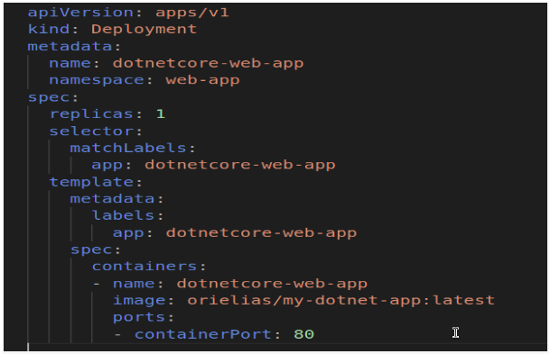

Create a Kubernetes Cluster And Deploy Jenkins, Using Elastic Kubernetes Service(EKS) :

EC2 Control Node Instance Type:
t3.small
AMI: Ubuntu.

Security Group Settings:    

Ports to Open:

22 for SSH

80 for HTTP

443 for HTTPS

.png)
.png)

SSH into EC2 Instance
ssh -i "your-key.pem" ubuntu@<EC2_PUBLIC_IP>

Change Host Name(Optional for comfort)
sudo hostnamectl set-hostname k8s-master
echo "127.0.0.1 k8s-master" | sudo tee -a /etc/hosts
(close the current SSH session and open a new one. 
The changes should take effect)

Update Packages
sudo apt-get update

Install AWS CLI
sudo apt install awscli -y

Install python3-pip
sudo apt install python3-pip
pip install --upgrade awscli

Configure AWS CLI
Run the “aws configure” command(Here you'll be prompted to enter details such as):
AWS Access Key ID: Your AWS Access Key.
AWS Secret Access Key: Your AWS Secret Access Key.
Default region name: The region where you want to create the EKS cluster. 
Default output format: You can leave this as ‘None’

Install EKSCTL
curl --silent --location "https://github.com/weaveworks/eksctl/releases/latest/download/eksctl_$(uname -s)_amd64.tar.gz" | tar xz -C /tmp
sudo mv /tmp/eksctl /usr/local/bin

*verify the installation
eksctl version

Install Kubectl
sudo apt-get update
sudo apt-get install -y apt-transport-https
sudo curl -fsSL https://packages.cloud.google.com/apt/doc/apt-key.gpg | sudo apt-key add -
echo "deb https://apt.kubernetes.io/ kubernetes-xenial main" | sudo tee -a /etc/apt/sources.list.d/kubernetes.list
sudo apt-get update
sudo apt-get install -y kubectl

Create an EKS Cluster
eksctl create cluster \
--name “cluster-name” \
--region “your-region” \
--nodes 1 \
--nodegroup-name “group-name” \
--node-type “instance-type” (e..g t2/t3.medium) \
--managed(simplifies node management.)

the output should be EKS cluster "cluster-name" in "region name" region is ready.

Confirm the cluster creation
eksctl get cluster --name ‘cluster-name --region “your region”

Verify that kubectl is properly communicating with your new cluster
kubectl version 

Create ‘devops’ namespace
kubectl create namespace devops

Allocating An Elastic IP 
Navigate to EC2 -> Elastic IP’s->Allocate Elastic IP Address -> Allocate ->
Choose the New IP, Actions, Associate elastic ip address ->Choose “Network Interface”, The Instance Network Interface, His Private IP-> Associate
.png)
.png)
.png)
.png)

Create a Jenkins Dockerfile With necessary installations

Build the Image: Navigate to the directory where the Dockerfile is located, then build the Docker image:
docker build -t <jenkins-image> .
docker tag  <jenkins-image> <username>/<repo-name:<tag>
docker push <username>/<repo-name:<tag>

Create a Jenkins persistent volume  YAML File
change values : to your “node name”

kubectl apply -f persistent-volume.yaml

Create a Jenkins persistent volume claim  YAML File

kubectl apply -f persistent-volume-claim.yaml

Create a Jenkins persistent local-storage YAML File

kubectl apply -f local-storage.yaml							

Expose the Jenkins Service

A NodePort service will open a specific port on all the cluster nodes, allowing external
  traffic to reach the service. (we specified 30000)

Apply the Service
kubectl apply -f jenkins-service.yaml
  the output should be : “service/jenkins created”

Create a Jenkins Deployment YAML File

Apply the Deployment
kubectl apply -f jenkins-deployment.yaml
 the output should be : “deployment.apps/jenkins created”

Verify The Exist Of the mountPath 

sh-4.2$ /bin/bash
[ssm-user@ip-192-168-39-114 bin]$ sudo mkdir -p /var/jenkins-data
sudo chmod -R 777 /var/jenkins-data

Allow Traffic on Port 30000
Navigate to: EC2 -> Instances -> Click on Instance ID (worker node) ->   Security ->  Security groups -> Inbound rules -> -> Edit inbound rules ->
Add rule (custom TCP, Port Range - 30000, CIDR - 0.0.0.0/0) -> Save rules
.png)
.png)

Access the Jenkins Website (nodeIP:NodePort)
to find the nodeIP use : kubectl get nodes -o wide
copy the EXTERNAL-IP

.png)

now reach the jenkins website through : EXTERNAL-IP:30000

Retrieve Jenkins Unlock Key
kubectl exec -it $(kubectl get pod -n devops -l app=jenkins -o jsonpath="{.items[0].metadata.name}") -n devops -- cat /var/jenkins_home/secrets/initialAdminPassword

copy the output and press ‘continue’ 

Install plugins
you can always install additional plugins later.

.png)

.png)

Create Admin user
fill the fields :

enter the public ip here http://”public-ip”:30000/

Configure jenkins to work with GitHub :
Create GitHub Account
go to : https://github.com
Click on “Sign Up”

Fill the Fields: 

Copy The Password that sent to your email

Create Personal Access Token (PAT) on GitHub:
Click on profile picture at top-right and choose “Settings”.

_on_GitHub:(1).png)

Scroll Down And choose “Developer Settings”

_on_GitHub:(2).png)

Click on "Personal access tokens" from the left sidebar, then click on "Generate new token.

_on_GitHub:(3).png)

Name the token and give it the necessary scopes (permissions)

_on_GitHub:(4).png)

Click "Generate token" at the bottom

Copy the generated token somewhere safe; you won't be able to see it again.
(its cut for safety reasons)

_on_GitHub:(5).png)

Add GitHub Configuration In Jenkins :
Open Jenkins in your browser, then navigate to "Manage Jenkins" -> " System."

.png)

Scroll down until you find the GitHub section
Click on "Add GitHub Server" and fill in the details.
Name: Can be any name to identify this GitHub configuration.
API URL: Usually this is https://api.github.com for GitHub.com

.png)

For "Credentials," click the "Add" button next to the dropdown.
Kind: Choose "Secret text."
Secret: Paste your GitHub Personal Access Token here.
ID: Can be any name to identify this secret.
Description: Optional, but helps you remember what this secret is for.

.png)

choose the new created credentials and press “Test connection”

.png)

the output should be something like “Credentials verified for user orioElias, rate limit:4999”
press “Save”

Create a GitHub Repository 
log in GitHub, you'll see a "+" icon in the upper-right corner next to your profile picture. Click on it and select "New repository."

.png)

Fill your repository details, then Click “Create repository”

.png)

Connect the New GitHub Repository To Jenkins:
Open your Jenkins interface, Click on "New Item" on the Jenkins dashboard, select "Pipeline," and then proceed.

.png)

In the pipeline configuration, Check "GitHub hook trigger for GITScm polling". Additionally you'll need to specify the source as your GitHub repository.
Source: Git
Repository URL: The URL of the GitHub repository you just created
Credentials: Create a new set of credentials in Jenkins using the same GitHub Personal Access Token (PAT) you generated earlier.

.png)

In the "Credentials" dropdown, click on the "Add" button and Jenkins.
For the “Kind” field, choose “Username with password.”
Enter your GitHub username in the “Username” field.
Paste your GitHub Personal Access Token in the “Password” field.
Add an ID and Description to identify these credentials.

.png)

Now, choose the New Credentials, Change “Branch Specifier (blank for 'any')”
From: “*/master” To  “*/main” And Click “SAVE”

.png)

Add GitHub Webhook to Trigger Jenkins Pipeline
GitHub Repository Settings: Navigate to "Settings" on your GitHub repository.

.png)

Webhooks: Go to the "Webhooks" tab and click on "Add webhook."

.png)

Use your Jenkins URL followed by /github-webhook/. For example, http://’your-public-ip:30000/github-webhook/
Content type: Choose application/json
Secret: Leave this blank if you haven’t set up a secret in Jenkins for webhook validation.
Choose "Just the push event" if you want the pipeline to run only when new commits are pushed.
Active: Make sure this checkbox is checked.
Click: “Add webhook”

.png)

Allow Traffic on Port 80 (For the Webhook, Same as we did Before)
Here's how to add a rule for port 80 in your AWS Security Group:
Navigate to: EC2 -> Instances -> Click on Instance ID (worker node) ->   Security ->  Security groups -> Inbound rules -> -> Edit inbound rules -> Add rule (HTTP, CIDR - 0.0.0.0/0) -> Save rules

.png)

Clone the repository to your local machine && Checking the Webhook: 

run in the terminal (in the directory that you want to clone your repo)
git clone https://github.com/<your-username>/<directory-name>.git
this will create a new directory that contains your GitHub repository.

cd <directory-name>
Make some changes to the existing files or add new files to the directory.
git add <filename>
git commit -m "Your commit message here"
git config --global credential.helper 'cache --timeout=3600' (optional) 

git push origin main
username: <your-username>
password: <Personal Access Token>
After you push the commit, your GitHub webhook should trigger your Jenkins pipeline if it's configured correctly.

Download an ASP.NET Core web application.
Download from Official Samples: Microsoft offers various sample projects that you can download directly. You can find these on the official ASP.NET Core samples page.

Creating Docker Hub credentials

Create a Docker Access Token:
Log in to Docker Hub.
Go to your account settings.
Navigate to the "Security" section.
Click on "New Access Token", provide a name for the token, and choose the level of access you want to grant.
Copy the generated token and keep it safe; you won't be able to see it again.

Configure Docker Credentials in Jenkins:
Go to Jenkins and navigate to "Manage Jenkins" -> "Manage Credentials".
Under "(global)" domain, click "Add Credentials".
Select "Username with password" from the "Kind" dropdown menu.
In the "Username" field, enter your Docker Hub username.
In the "Password" field, paste the Docker access token you generated.
Provide a unique ID (e.g., 'docker-hub-token') and a description for the credentials.

Docker-outside-of-Docker (DooD)
Launch a new t2.micro EC2 instance with Ubuntu AMI
SSH into Docker-Host
sudo apt-get update && sudo apt-get upgrade -y

Install Docker
curl -fsSL https://get.docker.com -o get-docker.sh
sudo sh get-docker.sh

Configure Docker Daemon
sudo nano /etc/docker/daemon.json
{
  "hosts": ["unix:///var/run/docker.sock", "tcp://0.0.0.0:2375"]
}
save.

Edit the Docker Service File:
sudo nano /lib/systemd/system/docker.service
Find the line that begins with ExecStart= and remove the part -H fd://
Save.
sudo systemctl daemon-reload
sudo systemctl restart docker

you can check the status by running :
sudo systemctl status docker

Open port 2375 for Inbound rule

Update Jenkins Deployment Configuration:
Update the containers  section to include the DOCKER_HOST environment variable with the IP address of your Docker-Host EC2 instance and port 2375:

Apply Updated Jenkins Configuration:
kubectl apply -f jenkins-deployment.yaml

Create a Jenkinsfile 

.png)

.png)

Create Dockerfile

Create deployment-web-app.yaml

Create a service To Access this WEB APP

Open port 30080 also in the security group

Create Cluster Role Files
jenkins-cluster-role-binding.yaml

kubectl apply -f jenkins-cluster-role-binding.yaml

jenkins-cluster-role.yaml

kubectl apply -f jenkins-cluster-role.yaml

Now you can push the new Files to the repository and See the pipeline runs :

